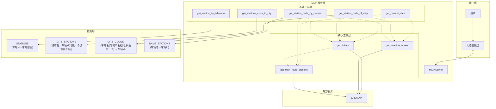

# 12306-MCP 服务架构

## 整体架构

```mermaid
graph TB
    subgraph "用户层"
        User["用户"]
        LLM["大语言模型"]
    end
    
    subgraph "MCP 服务层"
        McpServer["MCP Server"]
        
        subgraph "基础工具层"
            GetDate["get_current_date"]
            GetCityStations["get_stations_code_in_city"]
            GetCityCodes["get_station_code_of_citys"]
            GetStationNames["get_station_code_by_names"]
            GetStationInfo["get_station_by_telecode"]
        end
        
        subgraph "核心工具层"
            GetTickets["get_tickets"]
            GetInterline["get_interline_tickets"]
            GetRoute["get_train_route_stations"]
        end
    end
    
    subgraph "数据层"
        Stations["STATIONS<br/>(车站id→车站信息)"]
        CityStationsMap["CITY_STATIONS<br/>(城市名→车站id(可能一个城市多个站))"]
        CityCodes["CITY_CODES<br/>(车站名(与城市名相同,只会有一个) →车站id)"]
        NameStations["NAME_STATIONS<br/>(车站名→车站id)"]
    end
    
    subgraph "外部服务"
        Api12306["12306 API"]
    end
    
    User --> LLM
    LLM <--> McpServer
    
    GetDate -.-> GetTickets
    GetDate -.-> GetInterline
    GetDate -.-> GetRoute
    GetCityCodes -.-> GetTickets
    GetCityCodes -.-> GetInterline
    GetStationNames -.-> GetTickets
    GetStationNames -.-> GetInterline
    GetStationNames -.-> GetRoute
    GetTickets -.-> GetRoute

    
    GetTickets --> Api12306
    GetInterline --> Api12306
    GetRoute --> Api12306
    
    GetCityStations --> CityStationsMap
    GetCityCodes --> CityCodes
    GetStationNames --> NameStations
    GetStationInfo --> Stations
```

